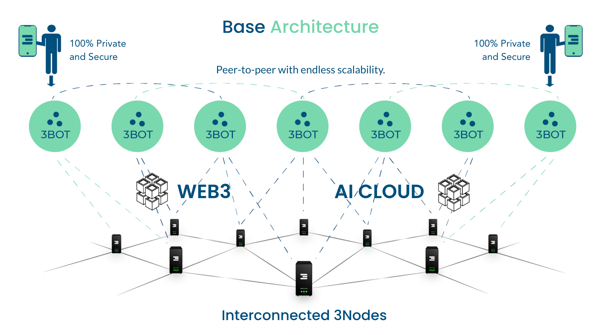
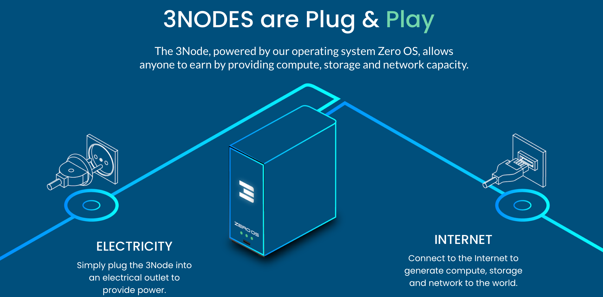
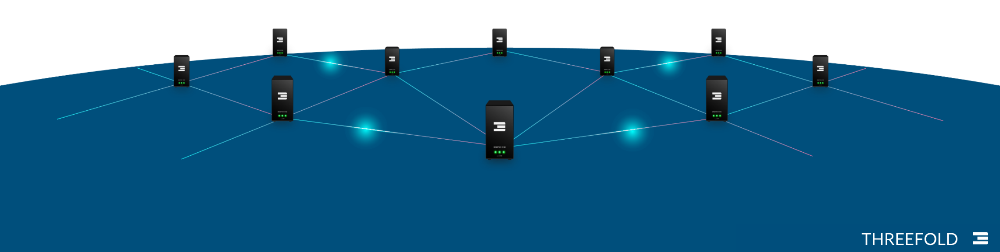
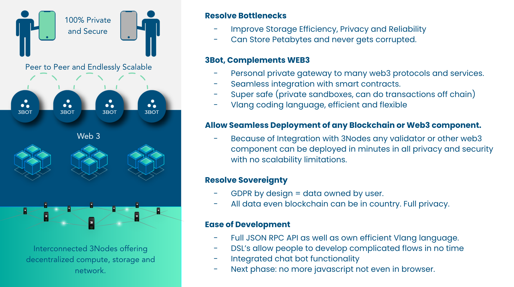
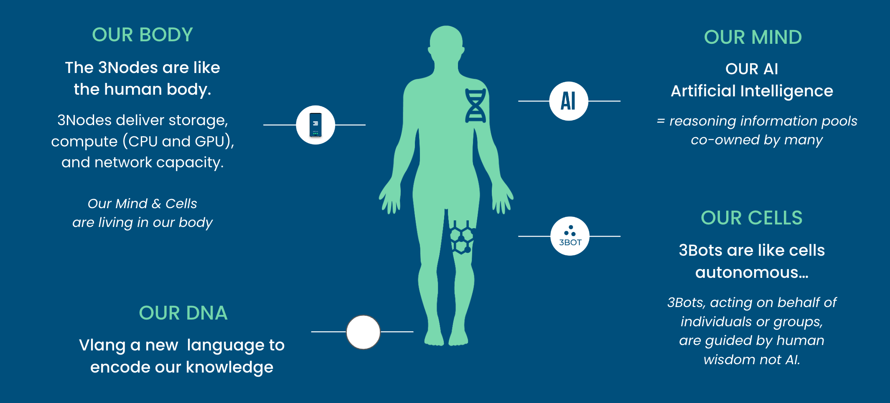
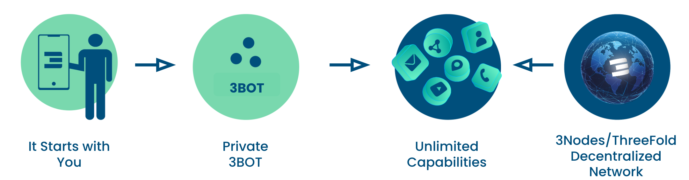

# How Does IT Work?

- **3Bots as Digital Twins**: 3Bots are the digital counterparts to each individual, and every person owns one unique digital twin.
- **Hosted on ThreeFold Internet Infrastructure**: Each digital twin, or 3Bot, is hosted on the ThreeFold Internet Infrastructure layer, ensuring a robust and secure foundation.
- **Unlimited Scalability Through Communication**: All 3Bots can communicate with each other, providing an interconnected network that delivers unlimited scalability.
- **End-to-End Encryption over Existing Internet**: The 3Bots converse over the existing Internet network, utilizing end-to-end encryption and choosing the shortest path to enhance security and efficiency.
- **Deployment and Participation in AI Clouds**: The 3Bots can deploy and participate in their own AI clouds, further expanding their capabilities and reach.
- **Integration with Web2 and Web3**: The 3Bots are versatile, capable of communicating and interacting with both Web2 and Web3 environments, bridging the gap between current and future digital landscapes.
- **Integrated with a Digital Freezone**: The digital freezone provides legal recognition and financial independence to the 3Bot, our Digital Twin, ensuring that it operates within a secure and autonomous framework.

## How do I interact with my Digital Twin.

Interacting with your digital twin is as simple as using your phone or any web browser. Here's how it works:

- **Voice and Chat Interaction**: You can talk or chat with your twin, and your AI cloud will convert your words into requests that your 3Bot understands. Human language is all you need to communicate with it.
- **Web User Interface**: Your twin offers a user-friendly interface with features that serve as alternatives to popular platforms such as Dropbox, Facebook, LinkedIn, Twitter, Zoom, Google Drive, and even a digital wallet for managing your money, along with collaboration tools.
- **Integration with Existing Applications**: Your twin's capabilities aren't confined to new interfaces. You can use existing applications on your phone or desktop, like your email, calendar, or contact app, as well as your desktop's file management interface (e.g., Finder on MAC OSX).
  
Your 3Bot is designed to serve you in the best possible way, integrating seamlessly with your existing services, providing a personalized and efficient digital experience that meets your unique needs.

## Main Components

### ThreeFold: The Infrastructure Layer

Imagine a system engineered to reach a planetary scale, where data is stored with absolute integrity, immune to corruption or loss. 

It's a futuristic landscape that seamlessly integrates AI, Cloud, Web2, Web3, and Edge IT workloads. Beyond mere compatibility, this system fosters collaboration, allowing groups of people to co-own and co-fund their software deployments. 

This system has the potential to recover from unforeseen events and provide 100% uptime

ThreeFold Farmers own and operate computers, hosting them for the benefit of their friends and communities. By providing this valuable service, they not only contribute to a shared technological ecosystem but also earn financial rewards. 

### The 3Bot

The 3Bot, acting as your digital twin, is a sophisticated personal assistant built using the Vlang development language. It encompasses a suite of features including sovereign chat for encrypted communication, personalized file storage that ensures data integrity, time management, and group collaboration tools, an integrated digital currency wallet, e-commerce functions, video conferencing, and automated financial management tools. 

Each 3Bot operates within a secure space, uniquely owned by the individual it represents, with underlying storage that is immune to corruption or loss. The ecosystem is designed for extensibility, allowing developers to create additional digital capabilities on top of the 3Bot using the VLang language.

The 3Bot technically lives in a virtual machine inside the ThreeFold Grid network and uses a Quantum Safe Storage system.

### The Personal AI Cloud layer

A personalized AI system, running on your behalf, acts as your digital extension, streamlining various aspects of your life. Leveraging advanced machine learning algorithms and tailored to your unique preferences, this AI can search through massive amounts of information on the internet or your personal files, quickly retrieving relevant data. It can act as a multilingual communication bridge, translating information into your preferred language, and enable you to interact with friends who speak different languages. 

By understanding your behavior and needs, it serves as a personal consultant, helping you make decisions and manage tasks more efficiently. Whether it's handling financial transactions, organizing your schedule, or even engaging in creative endeavors like content creation, your personalized AI system ensures that information is always at your fingertips, and daily tasks are executed swiftly and accurately. 

It transforms the way you interact with the world, making everything more accessible, efficient, and personalized.

### The Application Layer

In our vision, we prefer to refer to applications as "experiences," distinguishing our approach from the app-centric, centralized world we currently find ourselves in. 

Developers have the freedom to create an unlimited number of these experiences using vlang or JavaScript, drawing upon the "primitive capabilities" of the 3Bot. 

This method allows for a more agile and streamlined development process, often reducing development time by a factor of ten. By shifting the focus from mere applications to meaningful experiences, we emphasize a more human-centric and decentralized approach to technology.

### The Digital FreeZone Layer

We have embarked on an exciting partnership with the world's first digital freezone, a remarkable territory that brings together some unparalleled superpowers. 

Imagine a zone with full regulatory authority, where laws and regulations can be tailored to fit unique requirements, and disputes are resolved in a fraction of the time traditional systems take. Financial innovation flourishes here, with a friendly tax environment, seamless global transactions, and easy integration with the financial world. 

Whether you're interested in crowdfunding, creating security tokens, owning digital assets, or organizing a legally compliant Decentralized Autonomous Organization (DAO), this digital freezone is a hub for cutting-edge financial activity. All of this is managed by the 3Bot assisted by your personal AI Cloud.

Embedded within the global network of The Common Wealth, it offers flexibility and compliance, revolutionizing how we perceive financial governance, collaboration, and growth. It's not merely a financial playground; it's a blueprint for the financial ecosystem of the future.

Your 3Bot can operate from within the digital freezone and leverage its capabilities.

## This system mimics nature

Nature, with its sustainable and regenerative processes, scales beautifully to a planetary level. Our system draws inspiration from this natural wonder, representing the entire digital world as if it were a physical body.

- **The 3Nodes** are akin to the body's energy providers, creating a space in which the cells can thrive and exist.
- **The 3Bots**, representing the cells, interact with one another and operate with full autonomy, much like the independent yet interconnected cells in our body.
- **The Mind** is embodied by our personal, sovereign AI Cloud, controlled by the 3Bots (or cells), allowing for intelligent decision-making and interaction.
- **The DNA**, the fundamental code of this system, is implemented using vlang. It defines the characteristics and behavior of the entire structure, just as DNA shapes the traits and functions of a living organism. You can explore more about vlang at [https://vlang.io/](https://vlang.io/).

By mirroring the principles of nature, we've created a harmonious digital ecosystem that prioritizes sustainability, autonomy, and interconnectedness.

## Internet Natural progression.

This is the Internet’s Natural Progression

The Internet was always meant to be a peer-to-peer infrastructure.   As large companies became profit and data centric, centralization quickly became the norm.

- It Starts with You
  - Mobiles, phones, computers and all devices which provide access to your 3Bot. 
- Private Sovereign 3BOT
  - Our Autonomous Assistant.
  - Can be hosted in your home or any trusted location 
  - Data can never be lost nor corrupted.
- Unlimited Capabilities
  - Unlimited access to information without manipulation. 
  - All your required digital experiences owned by only you.
- 3Nodes/ThreeFold Decentralized Network
  - Quantum Safe Storage, Overlay Network Distributed Compute, Smart Contract for IT
  - You can host your 3bot on any location you require.

