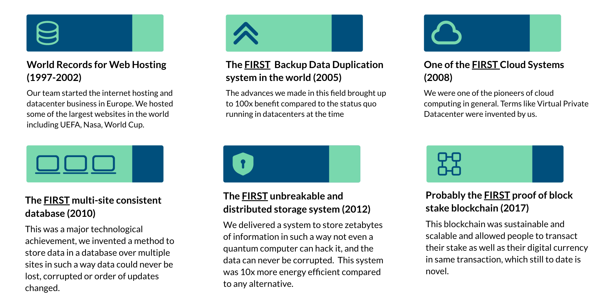
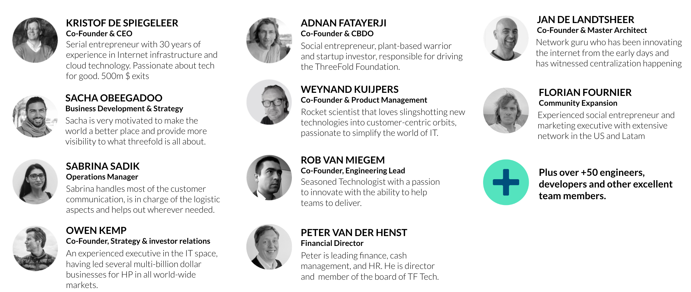
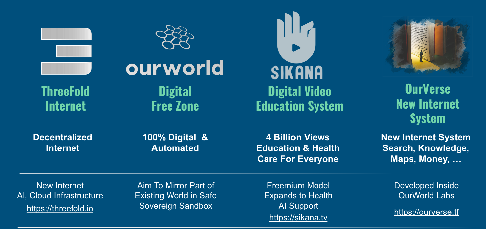
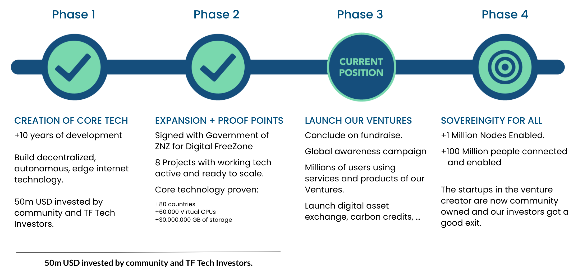

# Who Are We

## We build on a successful track record

Our team has built some of the world’s most advanced Internet and cloud technologies that were later acquired by some of the biggest names in the space for a cumulated +USD 600 million.

## We are value driven

> **Restore the commons through our self-sovereignity.**

- **PLANET FIRST**: 
  - Our planet is our home, and its well-being is paramount. Every action we take must prioritize its benefit and sustainability. Nothing we do can come at the expense of Mother Earth.
  - Restore the commons: see [http://restorethecommons.org](http://restorethecommons.org)
- **PEOPLE FIRST**: 
  - People and communities are at the heart of our existence. They are what we live for and value above all. Our focus on people ensures that our actions resonate with compassion, connection, and the shared goal of collective prosperity.
  - Every person needs to be sovereign and aware of their own power before its possible to restore the commons.

#### Our tools to achieve above

- AUTHENTICITY
    - restore authenticity of people and information.
- OPEN SOURCE
    - for all knowledge and all code we create
- SIMPLICITY
    - complexity is killing progress.

## Team

We are about 70 people in ThreeFold and more than 50 people are helping us from our community on daily basis.

Below you can find some of us:

We are expanding our venture creator, contact us if you would like to be part of one of our projects.

## What the future holds

We are part of a venture creator called OurWorld which has access to amazing technology.

This venture creator is working on following milestones.

## Come and visit us

We are a global group of changemakers with our HQ in Mauritius and Zanzibar.

Come and visit us in Zanzibar where we work together with the government on our our projects as well.

